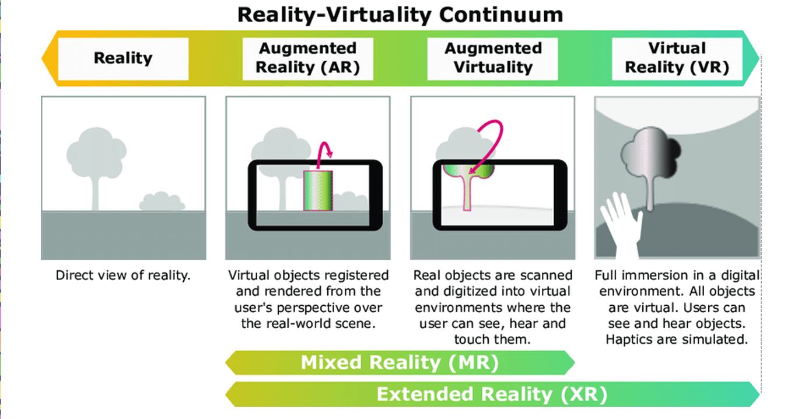

# Week 6 - Videogames and VR Ethics

## XR Continuum
- Extended Reality (XR) is an umbrella term that encompasses all forms of computer-altered reality, including Virtual Reality (VR), Augmented Reality (AR), and Mixed Reality (MR)

## What is Virtual Reality (VR)
- According to Phillip Brey, it's a three-dimensional interactive computer-generated environment that incorporates a first-person perspective. However, Brey's definition only touches on immersion through a first-person perspective and real-time interaction, later critiques have delved deeper into the psychological aspects of **presence**. Researchers have explored how factors such as sensory fidelity, user control, and narrative can enhance or detract from the sense of "being there" in a virtual environment

- Since it's a three-dimensional environment, it means that this virtual environment is designed to simulate a three-dimensional space, providing depth and spatial relationships similar to those experienced in the physical world. This 3D aspect enhances the realism and immersion for the user

- Interaction is a key feature of virtual reality. It implies that users can engage with the virtual environment in various ways, such as moving objects, navigating through the space, or triggering events. This is crucial for creating a sense of presence and involvement

## Psychologicall and Physical Impacts
- Psychological effects
    - age, gender, racial profiles of avatars can change the behaviours, perceptions and biases of the wearer

- Effects on mental health
    - VR can be used for therapeutic purposes, such as exposure therapy for phobias or PTSD. However, it can also lead to negative effects like dissociation or addiction if not used responsibly

- Physical and personal safety during and after use
    - Users may experience motion sickness, eye strain, or disorientation during or after VR sessions. It's important to take breaks and ensure a safe physical environment to prevent accidents

- Effects on physical health
    - Prolonged use of VR can lead to physical discomfort, such as neck or back pain from wearing headsets. Additionally, the sedentary nature of VR experiences may contribute to a lack of physical activity

- Long-term harms  
    - The long-term effects of VR use are still being studied, but concerns include potential impacts on vision, cognitive development in children, and social isolation if VR replaces real-world interactions

## Privacy and Data Security
- Associational Privacy
    - is the ability to include and exclude people from certain events or the global village, in which everyone could potentially learn important and trivial matters about others

- Informational Privacy
    - is the increased vulnerabilit of data or its misuse

- Physical Privacy
    - is the prevalence of recording devices or the unintended revelation of physical information (such as physical reactions to advertisements and the loss of anonymity)

## Content and Behaviour
Is a crime committed in a virtual environment considered a crime in the real world? 

### Metacrime
- Range of harms:
    - identity theft, deepfakes, financial fraud, virtual property theft, virtual assault and harassment, grooming and child exploitation, IP infringement (including NFTs), platform hacking, coordinated misinformation, and facilitation of real-world crimes

- Equivalence of virtual and real harms:
    - ethical and legal weight depends on harm severity, psychological impact, and real-world consequences; jurisdictions vary, creating cross-border enforcement challenges

- Evidence and forensics:
    - capture and preservation of VR logs, timestamps, motion traces, and recordings are essential for investigationsl chain-of-custody and standardised formats improve chances of prosecution

- Platform responsibilities:
    - design reporting and blocking tools, provide fast-response moderation, enable trusted third-party review for complex incidents, and publish transparency reports and community standards

- Policy Responses  
    - harmonise cross-jurisdiction rules where possible, require safety-by-design in platform approval, and establish specialised law enforcement for XR crimes.

## Accessibility and Inclusive Design
- Accessibility domains:
    - mechanics (difficulty, pacing), interface (UI, control remapping), animations (speed, intensity), representation (respectful portrayal of disability and neurodiversity)

- Core accessibility features:
    - subtitles and captions, text size and contrast, control remapping, multitple input support, adjustable camera and motion sensitivity, colour-blind palettes, audio cues, and spatial audio alternatives, and options to reduce motion/visual intensity to prevent cybersickness/epilepsy triggers

- Accessible-first approach:
    - integrate accessibility from design inception rather than retrofitting. Early decisions (input model, HUD, control flexibility) have outsize effects on inclusion and development cost

- Testing and community involvement:
    - include players with diverse abilities in playtesting, adopt assistive-tech compatibility checks, and run accessibility audits agains WCAG-inspired criteria adapted for games and XR

- Representation ethics:
    - avoid simplistic or voyeuristic "disability simulations" that evoke pity or anxiety; consult lived-experience communities when creating disabled characters and ensure portrayals add agency and nuance

- Benefits beyond disability:
    - accessibility features often improve usability for all players, increasing market reach and player satisfaction