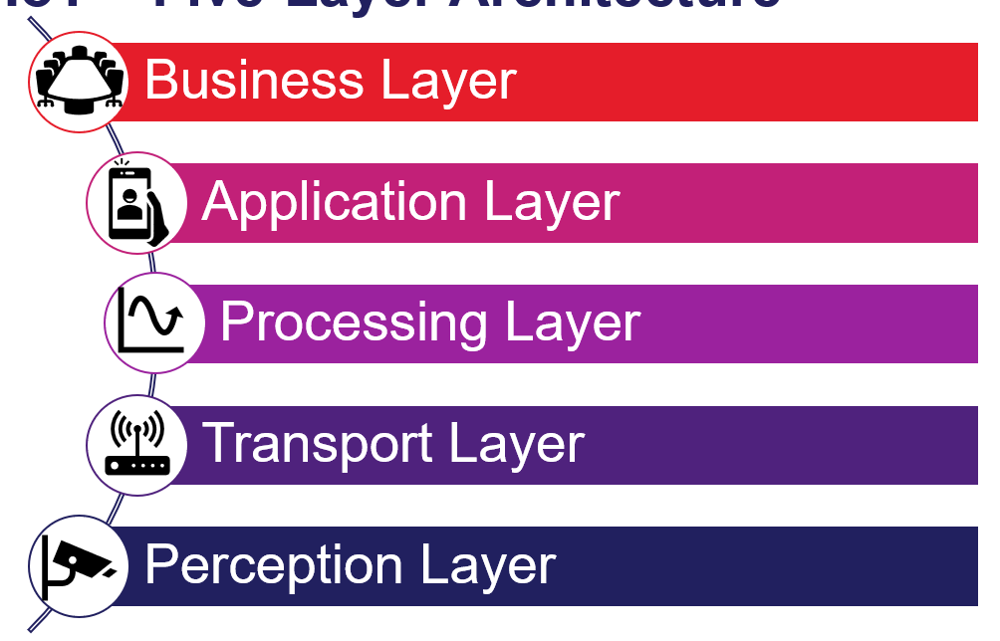
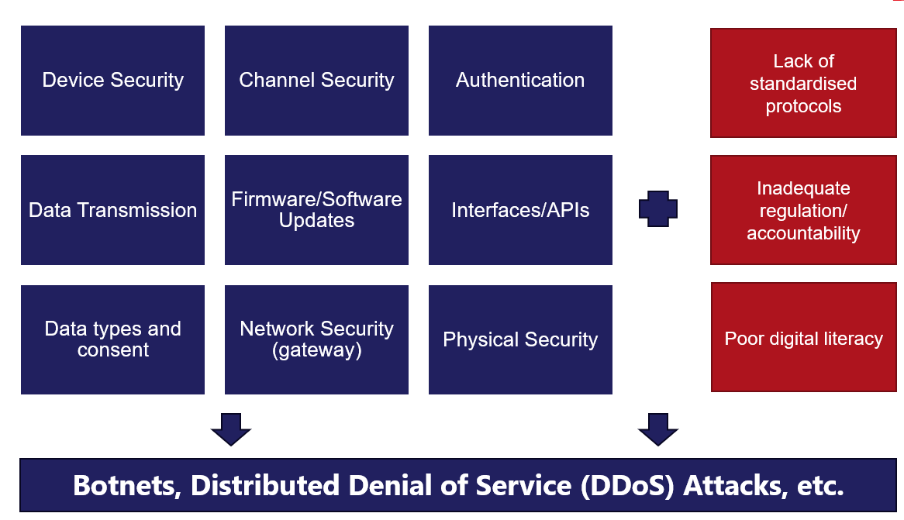

# Week 8 - Internet of Things

## What is the Internet of Things (IoT)?
1. Interconnectivity
    - IoT devices are interconnected through the internet, allowing them to communicate and share data

2. Sensing and Data Collection
    - devices are equipped with sensors to collect real-time data from their environment

3. Automation and Control
    - IoT systems enable automated responses and control actions based on the data collected

4. Scalability
    - IoT infrastructure is designed to accommodatee a large number of devices and handle vast amounts of data

5. Intelligence and Analytics
    - IoT leverages data analytics and machine learning to derive insights and make informed decisions

- many applications, including smart homes, transport, wearables, health tech, agriculture, and industrial systems use IoT

## IoT Five-Layer Architecture

1. Perception Layer
    - responsible for sensing and data collection through various sensors and devices

2. Transport Layer
    - handles data transmission between the perception layer and the processing layer using communication protocols

3. Processing Layer
    - processes and analyzes the collected data, often using cloud computing or edge computing

4. Application Layer
    - provides specific services and applications based on the processed data, such as smart home management or health monitoring

5. Business Layer
    - oversees the overall IoT system, including business models, user privacy, and data security

## IoT Development Timeline

**Early Beginnings (1990s - 2000s)**
- conceptual foundation = M2M communication
- the term "Internet of Things" was coined by Kevin Ashton in 1999
- intial applications was primarily in industrial/enterprise settings

**Growth and Expansion (2000s - 2010s)**
- technological advancements include:
    - wireless communication technologies
    - smartphones
    - affordable sensor hardware
    - cloud computing

**Maturation and Integration (2010s - Present)**
- standardised communication protocols start to improve interoperability
- enhanced capability through AI and ML

## Security and IoT

## Privacy and Consent in IoT
- the following are data privacy concerns specific to IoT:
    - sensitive data and sensitive use cases 
    - triangulation across devices/services
    - dense ToS and privacy statements: implicit consent
    - user apathy/desensitisation
    - constant data generation and surveillance

### IoT Australian Code of Practice
1. No duplicated default or weak passwords
2. Implement a vulnerability disclosure policy
3. Keep software securely updated
4. Securely store credentials
5. Ensure that personal data is protected
6. Minimise exposed attack surfaces
7. Ensure communication security
8. Ensure software integrity
9. Make systems resilient to outages
10. Monitor system telemetry datat
11. Make it easy for consumers to delete personal data
12. Make installation and maintenance of devices easy
13. Validate input data

## Responsible AI
- it refers to the practice of designing, developing, and deploying AI systems in a manner that ensures fairness, transparency, accountability, and ethical considerations.

### How can AI be Ethical?
1. Wellbeing
    - AI systems should benefit individuals, society and the environment

2.  Human-centered
    - AI systems should respect human rights, diversity, and the autonomy of individuals

3. Fairness
    - AI systems should be inclusive and accessible, and should not involve or result in unfair discrimination against individuals, communities or groups

4. Privacy and Security
    - AI systems should respect privacy rights and data protection, and ensure the security of data

5. Reliability and Safety
    - AI systems should reliably operate in accordance with their intended purpose

6. Transparency and Explainability
    - there should be transparency and responsible disclosure, so that people can understand when they are being significantly impacted by Ai and can find out when an AI system is engaging with them

7. Contestability
    - when an AI system significantly impacts a person, community, group or environment, there should be a timely process to allow people to challenge the use or outcomes of the AI system

8. Accountability
    - people responsible for the different phases of the AI system lifecycle should be identifiable and accountable for the outcomes of the AI system, and human oversight of AI systems should be enabled